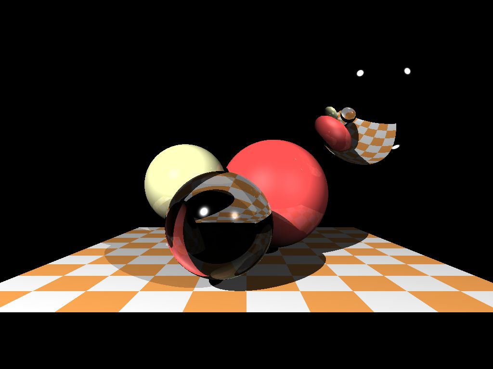

### A re-implementation of the Tiny Raytracer, in Zig

> Work In Progress

Re-implements https://github.com/cishiv/tiny-raytracer

Looks a little whacky!

### Credits

- stb headers from http://nothings.org/stb/
- initial implementation in C++ from https://github.com/ssloy/tinyraytracer